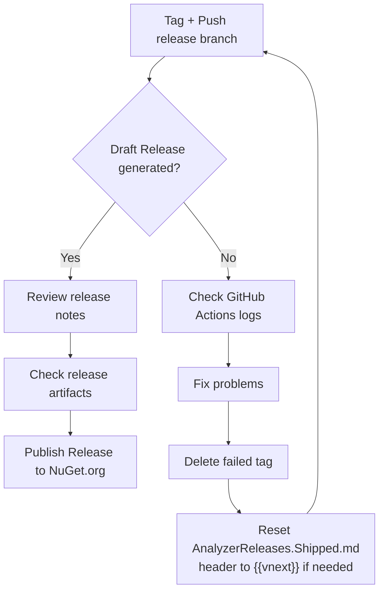

This markup can be edited and converted to .svg or .png here:
https://www.mermaidchart.com/app/projects/95759d78-db93-499c-ad66-0e3f698ba88c/diagrams/31dbd6bc-7ec8-4583-a456-55e3fe3f6cfc/version/v0.1/edit

